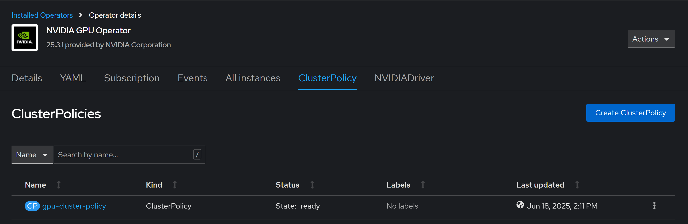
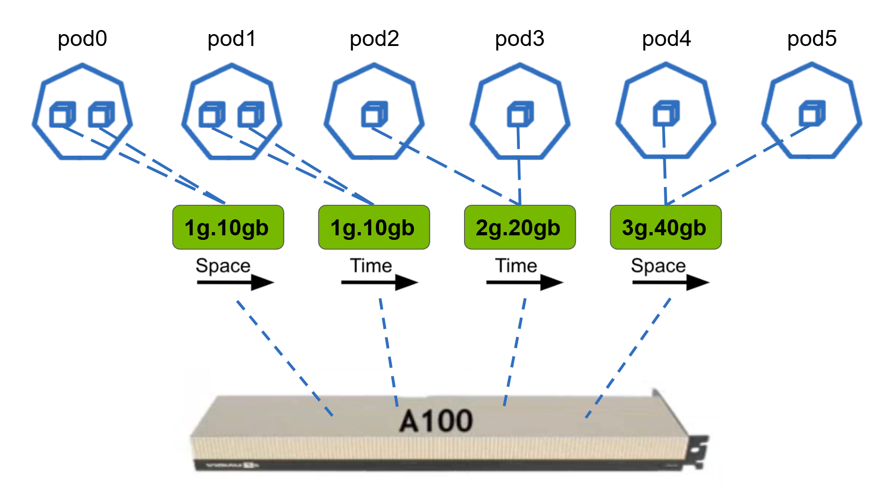

# Running the NVIDIA DRA Driver on Red Hat OpenShift

This document details how to install and run the NVIDIA DRA driver on Openshift 4.18

## Prerequisites

1. OpenShift 4.18
2. OpenShift CLI `oc`
3. NVIDIA GPU Operator
4. OpenShift DRA

## Installation Walkthrough

### Install OpenShift

Install OpenShift 4.18. You can use the Assisted Installer to install on bare metal, or obtain an IPI installer binary (`openshift-install`) from the [OpenShift clients page](https://mirror.openshift.com/pub/openshift-v4/clients/ocp/) page. Refer to the [OpenShift documentation](https://docs.redhat.com/en/documentation/openshift_container_platform/latest/html/installation_overview/ocp-installation-overview) for different installation methods.

### Install OpenShift CLI

Install the OpenShift CLI `oc`. See the official documentation [here](https://docs.redhat.com/en/documentation/openshift_container_platform/4.18/html/cli_tools/openshift-cli-oc#cli-about-cli_cli-developer-commands) and the official downloads [here](https://console.redhat.com/openshift/downloads)


### Install the NVIDIA GPU Operator

Install NVIDIA GPU Operator **_v25.3.1_** by following the official documentation [here](https://docs.nvidia.com/datacenter/cloud-native/openshift/24.9.2/steps-overview.html). **Make sure** to also install the Node Feature Discovery Operator as it is a required dependency of the GPU Operator (this example uses version **_4.18.0-202505200035_**).

Once installed, begin creating the default cluster policy as described [here](https://docs.nvidia.com/datacenter/cloud-native/openshift/25.3.1/install-gpu-ocp.html#create-the-clusterpolicy-instance). The only change that needs to be done to the default policy is to disable the devicePlugin

```yaml
...
  devicePlugin:
    config:
      ...
    enabled: false
    mps:
      ...
...
```

Create the policy with that one change and wait for the state to be `ready` (this can take up to 30 minutes)



### MIG

If MIG is going to be used on the node, enable it with the following commands

Set the strategy to mixed

```bash
STRATEGY=mixed && \
  oc patch clusterpolicy/gpu-cluster-policy --type='json' -p='[{"op": "replace", "path": "/spec/mig/strategy", "value": '$STRATEGY'}]'
```

Set the desired MIG profiles. The available default MIG profiles can be seen [here](https://gitlab.com/nvidia/kubernetes/gpu-operator/-/blob/v1.8.0/assets/state-mig-manager/0400_configmap.yaml). To create custom profiles, follow [these instructions](https://docs.nvidia.com/datacenter/cloud-native/openshift/25.3.1/mig-ocp.html#creating-and-applying-a-custom-mig-configuration). This example will use the `all-balanced` MIG setup.

```bash
NODE_NAME=<node name> && MIG_CONFIGURATION=all-balanced && oc label node/$NODE_NAME nvidia.com/mig.config=$MIG_CONFIGURATION --overwrite
```

Check the status of the profile change by running

```bash
oc -n nvidia-gpu-operator logs ds/nvidia-mig-manager --all-containers -f --prefix
```

If successful, the logs will look something like this

```
...
[pod/nvidia-mig-manager-nq2fs/nvidia-mig-manager] node/<node name> labeled
[pod/nvidia-mig-manager-nq2fs/nvidia-mig-manager] Changing the 'nvidia.com/mig.config.state' node label to 'success'
[pod/nvidia-mig-manager-nq2fs/nvidia-mig-manager] node/<node name> labeled
[pod/nvidia-mig-manager-nq2fs/nvidia-mig-manager] time="2025-06-18T18:38:35Z" level=info msg="Successfully updated to MIG config: all-balanced"
[pod/nvidia-mig-manager-nq2fs/nvidia-mig-manager] time="2025-06-18T18:38:35Z" level=info msg="Waiting for change to 'nvidia.com/mig.config' label"
```

Finally, use the NVIDIA GPU Operator to confirm the MIG profiles were created succesfully. Start by identifying the driver daemonset

```bash
oc get pods -n nvidia-gpu-operator | grep nvidia-driver-daemonset
```

Then run `nvidia-smi` through the daemonset with

```bash
oc exec -ti <nvidia-driver-daemonset-xxxxx...> -n nvidia-gpu-operator -- nvidia-smi
```

If successful, you should see something like this that shows your MIG profiles
```
Wed Jun 18 19:22:47 2025       
+-----------------------------------------------------------------------------------------+
| NVIDIA-SMI 570.148.08             Driver Version: 570.148.08     CUDA Version: 12.8     |
|-----------------------------------------+------------------------+----------------------+
| GPU  Name                 Persistence-M | Bus-Id          Disp.A | Volatile Uncorr. ECC |
| Fan  Temp   Perf          Pwr:Usage/Cap |           Memory-Usage | GPU-Util  Compute M. |
|                                         |                        |               MIG M. |
|=========================================+========================+======================|
|   0  NVIDIA A100 80GB PCIe          On  |   00000000:B6:00.0 Off |                   On |
| N/A   54C    P0             90W /  300W |     249MiB /  81920MiB |     N/A      Default |
|                                         |                        |              Enabled |
+-----------------------------------------+------------------------+----------------------+

+-----------------------------------------------------------------------------------------+
| MIG devices:                                                                            |
+------------------+----------------------------------+-----------+-----------------------+
| GPU  GI  CI  MIG |                     Memory-Usage |        Vol|        Shared         |
|      ID  ID  Dev |                       BAR1-Usage | SM     Unc| CE ENC  DEC  OFA  JPG |
|                  |                                  |        ECC|                       |
|==================+==================================+===========+=======================|
|  0    1   0   0  |             107MiB / 40192MiB    | 42      0 |  3   0    2    0    0 |
|                  |                 0MiB / 65535MiB  |           |                       |
+------------------+----------------------------------+-----------+-----------------------+
|  0    5   0   1  |              71MiB / 19968MiB    | 28      0 |  2   0    1    0    0 |
|                  |                 0MiB / 32767MiB  |           |                       |
+------------------+----------------------------------+-----------+-----------------------+
|  0   13   0   2  |              36MiB /  9728MiB    | 14      0 |  1   0    0    0    0 |
|                  |                 0MiB / 16383MiB  |           |                       |
+------------------+----------------------------------+-----------+-----------------------+
|  0   14   0   3  |              36MiB /  9728MiB    | 14      0 |  1   0    0    0    0 |
|                  |                 0MiB / 16383MiB  |           |                       |
+------------------+----------------------------------+-----------+-----------------------+
                                                                                         
+-----------------------------------------------------------------------------------------+
| Processes:                                                                              |
|  GPU   GI   CI              PID   Type   Process name                        GPU Memory |
|        ID   ID                                                               Usage      |
|=========================================================================================|
|  No running processes found                                                             |
+-----------------------------------------------------------------------------------------+
```

### Enabling DRA on OpenShift
> [!CAUTION]
> Enabling DRA in OpenShift permanently prevents the cluster from being upgraded with minor updates and [cannot be undone](https://docs.redhat.com/en/documentation/openshift_container_platform/4.18/html/nodes/working-with-clusters#:~:text=on%20production%20clusters.-,Warning,-Enabling%20the%20TechPreviewNoUpgrade). Only proceed if this does not matter for your cluster.

DRA is an experimental feature and is not available by default in OpenShift. To use it, enable the `TechPreviewNoUpgrade` feature set as explained in [Enabling features using FeatureGates](https://docs.redhat.com/en/documentation/openshift_container_platform/4.18/html/nodes/working-with-clusters#nodes-cluster-enabling), either with the CLI or Web Console. The feature set includes the `DynamicResourceAllocation` feature gate.

Next, set the scheduler to have `HighNodeUtilization` in the CLI

```bash
$ oc patch --type merge -p '{"spec":{"profile": "HighNodeUtilization"}}' scheduler cluster
```

Due to OpenShift's stricter security requirements, the following `securityContext` configuration needs to be added to each container in Pod/Deployment yamls. Examples of this can be seen in the `./demo/quickstart/` directory

```yaml
securityContext:
  runAsNonRoot: true
  seccompProfile:
    type: RuntimeDefault
  allowPrivilegeEscalation: false
  capabilities:
    drop:
      - ALL
```

Additionally, to ensure images do not override the MIG profiles specified by DRA, the following environment variable needs to be set in each container as well

```yaml
env:
  - name: NVIDIA_VISIBLE_DEVICES
    value: void
```


### Install the DRA Driver

This DRA Driver is built off of [NVIDIA's DRA Driver](https://github.com/NVIDIA/k8s-dra-driver-gpu/tree/main) for Kubernetes 1.31 and uses the the [v1alpha3 DRA API](https://v1-31.docs.kubernetes.io/docs/concepts/scheduling-eviction/dynamic-resource-allocation/#api)

Clone the repo and cd into it

```bash
git clone https://github.com/ztouchnetworks/k8s-dra-driver-gpu.git
```

Pulling the DRA Image requires permission from Z-Touch. Create the pull secret by running
```
oc create namespace nvidia
oc create secret generic registry-access-secret --from-file=.dockerconfigjson=$HOME/.docker/config.json --type=kubernetes.io/dockerconfigjson -n nvidia
```

Install the DRA driver

```bash
./demo/clusters/openshift/install-dra-driver.sh
```

And make sure the pods startup correctly
```bash
oc get pods -n nvidia
```
```
NAME                                                          READY   STATUS    RESTARTS   AGE
nvidia-dra-driver-k8s-dra-driver-controller-6c8958947-ls6px   1/1     Running   0          10s
nvidia-dra-driver-k8s-dra-driver-kubelet-plugin-pskgj         1/1     Running   0          10s
```

#### Building a Custom Image

If any custom changes need to be made to DRA Driver image, modify the necessary files and rebuild the image
```bash
./demo/clusters/openshift/build-dra-driver.sh
```
This image will then need to be added to a registry so it can be referenced by [`./versions.mk`](./versions.mk#L18), [`./deployments/helm/k8s-dra-driver/Chart.yaml`](./deployments/helm/k8s-dra-driver/Chart.yaml#L18), and [`./deployments/helm/k8s-dra-driver/values.yaml`](./deployments/helm/k8s-dra-driver/values.yaml#L52)

## Demo

The following demo will utilize a single A100 GPU with the `all-balanced` MIG setup used in the installation instructions. The demo will create 6 pods to demonstrate DRA:

| Pods      | MIG Profile | Sharing Strategy | Total Containers |
|-----------|-------------|------------------|:----------:|
| pod0      | 1g.10gb (0)    | MPS              |      2     |
| pod1      | 1g.10gb (1)    | Time Slicing     |      2     |
| pod2, pod3 | 2g.20gb     | Time Slicing     |      2     |
| pod4, pod5 | 3g.40gb     | MPS              |      2     |





You can run the demo with:
```bash
oc apply  -f ./demo/quickstart/gpu-test-mig.yaml
```

All 6 pods should then be created. Some of the pods may still be in the `ContainerCreating` state while the MPS control daemon starts up

```bash
oc get pods -n gpu-test-mig
```
```
NAME   READY   STATUS              RESTARTS   AGE
pod0   0/2     ContainerCreating   0          7s
pod1   0/2     ContainerCreating   0          7s
pod2   0/1     ContainerCreating   0          7s
pod3   0/1     ContainerCreating   0          6s
pod4   0/1     ContainerCreating   0          6s
pod5   0/1     ContainerCreating   0          6s
```

To check the status of the MPS control daemons run the following

```bash
oc get pods -n nvidia | grep mps-control-daemon
```
```
mps-control-daemon-270565e7-dfda-4ac4-a5f3-3cc8187ff0e3-07z8fps   0/1     ContainerCreating   0          1s
mps-control-daemon-270565e7-dfda-4ac4-a5f3-3cc8187ff0e3-6bscg78   1/1     Running             0          5s
```

Once all pods are in the running state, confirm that the GPU is being shared correctly by running

```bash
oc exec -ti <nvidia-driver-daemonset-xxxxx...> -n nvidia-gpu-operator -- nvidia-smi
```

If sucessful, there should be 10 processes running on the GPU: 
- 1 for each container (8 total | 2 on each MIG profile)
- 1 MPS server for MIG profile 1g.10gb
- 1 MPS server for MIG profile 3g.40gb

```
Mon Jun 23 15:43:26 2025       
+-----------------------------------------------------------------------------------------+
| NVIDIA-SMI 570.148.08             Driver Version: 570.148.08     CUDA Version: 12.8     |
|-----------------------------------------+------------------------+----------------------+
| GPU  Name                 Persistence-M | Bus-Id          Disp.A | Volatile Uncorr. ECC |
| Fan  Temp   Perf          Pwr:Usage/Cap |           Memory-Usage | GPU-Util  Compute M. |
|                                         |                        |               MIG M. |
|=========================================+========================+======================|
|   0  NVIDIA A100 80GB PCIe          On  |   00000000:B6:00.0 Off |                   On |
| N/A   57C    P0            223W /  300W |    5728MiB /  81920MiB |     N/A      Default |
|                                         |                        |              Enabled |
+-----------------------------------------+------------------------+----------------------+

+-----------------------------------------------------------------------------------------+
| MIG devices:                                                                            |
+------------------+----------------------------------+-----------+-----------------------+
| GPU  GI  CI  MIG |                     Memory-Usage |        Vol|        Shared         |
|      ID  ID  Dev |                       BAR1-Usage | SM     Unc| CE ENC  DEC  OFA  JPG |
|                  |                                  |        ECC|                       |
|==================+==================================+===========+=======================|
|  0    1   0   0  |            1442MiB / 40192MiB    | 42      0 |  3   0    2    0    0 |
|                  |                 6MiB / 65535MiB  |           |                       |
+------------------+----------------------------------+-----------+-----------------------+
|  0    5   0   1  |            1513MiB / 19968MiB    | 28      0 |  2   0    1    0    0 |
|                  |                 4MiB / 32767MiB  |           |                       |
+------------------+----------------------------------+-----------+-----------------------+
|  0   13   0   2  |            1376MiB /  9728MiB    | 14      0 |  1   0    0    0    0 |
|                  |                 4MiB / 16383MiB  |           |                       |
+------------------+----------------------------------+-----------+-----------------------+
|  0   14   0   3  |            1398MiB /  9728MiB    | 14      0 |  1   0    0    0    0 |
|                  |                 6MiB / 16383MiB  |           |                       |
+------------------+----------------------------------+-----------+-----------------------+
                                                                                         
+-----------------------------------------------------------------------------------------+
| Processes:                                                                              |
|  GPU   GI   CI              PID   Type   Process name                        GPU Memory |
|        ID   ID                                                               Usage      |
|=========================================================================================|
|    0    1    0          3817640    M+C   /tmp/sample                             648MiB |
|    0    1    0          3817645      C   nvidia-cuda-mps-server                   30MiB |
|    0    1    0          3817656    M+C   /tmp/sample                             648MiB |
|    0    5    0          3817655      C   /tmp/sample                             714MiB |
|    0    5    0          3817659      C   /tmp/sample                             714MiB |
|    0   13    0          3817658      C   /tmp/sample                             664MiB |
|    0   13    0          3817700      C   /tmp/sample                             664MiB |
|    0   14    0          3817404    M+C   /tmp/sample                             662MiB |
|    0   14    0          3817406      C   nvidia-cuda-mps-server                   30MiB |
|    0   14    0          3817454    M+C   /tmp/sample                             662MiB |
+-----------------------------------------------------------------------------------------+
```

Other demos can be run in the `./demo/quickstart/` directory. Some of the demos may utilize more than 1 GPU or may use a GPU without MIG enabled
